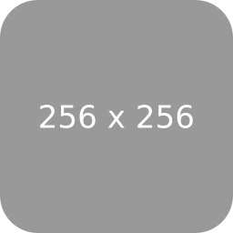

# 설치방법

A. npm i yarn

둘중 C,B 선택해서 설치하시면 됩니다.

B.# global install
- yarn global add vuepress@next

C.# install as a local dependency
- yarn add -D vuepress@next

mkdir docs
- docs 다운로드만 해서 같다가 상위 경로에 붙치시면 실행이 됩니다.
# 마크다운 파일을 생성한다.
echo '# Hello VuePress' > docs/README.md

pakcage.json

"scripts": {
"docs:dev": "vuepress dev docs",
"docs:build": "vuepress build docs"
}

---
title: Home
meta:
  - name: description
    content: Page description
  - name: keywords
    content: js vuejs vuepress
---

# vuepress

> Awesome description

  

[[toc]]

##### Check out for more Markdown Extensions [here](https://vuepress.vuejs.org/guide/markdown.html#header-anchors)

## Article 1

"sample"

## Article 2

"Lorem ipsum dolor sit amet, consectetur adipiscing elit, sed do eiusmod tempor incididunt ut labore et dolore magna aliqua. Ut enim ad minim veniam, quis nostrud exercitation ullamco laboris nisi ut aliquip ex ea commodo consequat. Duis aute irure dolor in reprehenderit in voluptate velit esse cillum dolore eu fugiat nulla pariatur. Excepteur sint occaecat cupidatat non proident, sunt in culpa qui officia deserunt mollit anim id est laborum."

## Components

Source at docs/.vuepress/components/

* <Demo/>
* <Button-Counter :start="0"/>
